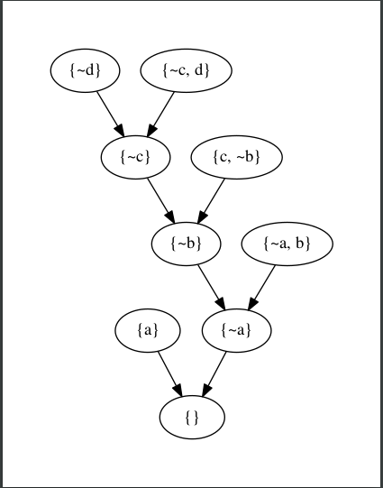

SENTENTIAL
==========

.. image:: https://travis-ci.org/joedougherty/sentential.svg?branch=master
    :target: https://travis-ci.org/joedougherty/sentential

An interpreter for sentential logic (propositional calculus) written in Python.

*A work in progress.*

**sentential** can help you:

+ Generate truth tables

.. code-block:: python

    from sentential import Proposition
    law_of_non_contradiction = Proposition('''¬(p & ¬p)''')
    law_of_non_contradiction.pretty_truth_table()

+-------+-----------+
| p     | ¬(p & ¬p) |
+-------+-----------+
| True  | True      |
+-------+-----------+
| False | True      |
+-------+-----------+

.. code-block:: python

    # Propositions can be combined with standard string operators
    law_of_non_contradiction = Proposition('''¬(p & ¬p)''')
    law_of_excluded_middle = Proposition('''(p v ¬p)''')

    the_nature_of_bivalence = Proposition('{} <-> {}'.format(lnc, lem))

    the_nature_of_bivalence.pretty_truth_table()

+-------+------------------------+
| p     | ¬(p & ¬p) <-> (p v ¬p) |
+-------+------------------------+
| True  | True                   |
+-------+------------------------+
| False | True                   |
+-------+------------------------+

.. code-block:: python

    # Inspect the internal representation
    law_of_non_contradiction.truth_table()

    # Results in:
    [OrderedDict([('p', True), ('expr_truth_value', True)]),
     OrderedDict([('p', False), ('expr_truth_value', True)])]

+ Determine if a proposition is a theorem/contradiction

.. code-block:: python

    law_of_non_contradiction.is_theorem() # True

    negated_lnc = Proposition('''¬(¬(p & ¬p))''')

    negated_lnc.is_contradiction() # True

+ Find the CNF (Conjunctive Normal Form) expression of a proposition

.. code-block:: python
    
    from sentential import Proposition

    prop = Proposition('''((p and w) -> !e)''')

    prop.cnf() # [{'~e', '~p', '~w'}]

**sentential** can also help you find proofs (by resolution).

.. code-block:: python
    
    from sentential import Proposition
    from sentential.KnowledgeBase import KnowledgeBase

    kb = KnowledgeBase()

    # Let's verify that we can run a proof using hypothetical syllogism 
    # (https://en.wikipedia.org/wiki/Hypothetical_syllogism)
    kb.add_axiom(Proposition('''a -> b'''))
    kb.add_axiom(Proposition('''b -> c'''))
    kb.add_axiom(Proposition('''c -> d'''))

    # Let's say we know it's the case that "a"
    kb.add_axiom(Proposition('''a'''))

    # Can we construct a proof that "d" is true (given what we know above)?
    kb.add_goal(Proposition('''d'''))

    # Indeed we can. A proof was found!
    kb.prove() # True

Proofs can be inspected further...

.. code-block:: python

    proof = kb.most_recent_proof()

    # Inspect the proof steps taken to arrive at the empty clause
    proof.steps

    # If you have graphviz installed, you can try generating
    # an image demonstating the proof as a graph
    proof.visualize()

SYNTAX
======

**sentential** was designed to allow you to express propositions using the familiar symbols of classical logic. 

The parser strives to minimize the user's mental overhead in converting his or her logical expressions into statements readable by sentential. 

Here are some examples of legal expressions one could use to instatiate a Proposition:

.. code-block:: python
    
    """p"""
    """p v q"""
    """(p v q)"""
    """¬((a -> s) iff (!w and r))"""
    """!¬(q)""" 

Double negation is supported. Most operations can be expressed with multiple symbols. You can use ``¬`` just as easily as ``!`` or ``~``. Mix and match as you please.

+--------+--------------------------------+
| Symbol | Operation                      |
+--------+--------------------------------+
| ¬      | Not                            |
+--------+--------------------------------+
| ~      | Not                            |
+--------+--------------------------------+
| !      | Not                            |
+--------+--------------------------------+
| v      | Or                             |
+--------+--------------------------------+
| or     | Or                             |
+--------+--------------------------------+
| &      | And                            |
+--------+--------------------------------+
| and    | And                            |
+--------+--------------------------------+
| ->     | if-then (conditional)          |
+--------+--------------------------------+
| iff    | if and only if (biconditional) |
+--------+--------------------------------+
| <->    | if and only if (biconditional) |
+--------+--------------------------------+
| =      | if any only if (biconditional) |
+--------+--------------------------------+

It is important to bear in mind that all sub-expressions may contain *at most* two terms and one binary operator.

Examples:

.. code-block:: python

    '''(p v q)'''       # Two terms:   ("p","q")        | One binary operator: "v"  | OK!
    '''p'''             # One term:    ("p")            | Zero binary operators     | OK!
    '''(p & q & r)'''   # Three terms: ("p","q","r")    | Two binary operators      | ERROR!!!

While it may occasionally be inconvenient to nest expressions with shared operators, this provides unambiguous grouping rules. What you lose in convenience, you gain in semantic precision.

The last example can be expressed: ``Proposition('''((p & q) & r)''')`` or ``Proposition('''(p & (q & r))''')``

You can even use **sentential** to verify these expressions are equivalent:

.. code-block:: python

    p1 = Proposition('''((p & q) & r)''')
    p2 = Proposition('''(p & (q & r))''')

    prop = Proposition('{} = {}'.format(p1, p2))

    prop.is_theorem() # True

